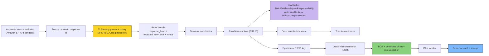

# Architecture diagram

> Reflects the current working chain after the **rawResponseB64 binding**: the TLS proof
> and the Nitro attestation bind to the same HTTP response bytes. (The older version of
> this page described TLSNotary as a blocked placeholder; it is now a real, live notary.)

## What the diagram means

- The source endpoint is the upstream system whose response is proven (Amazon SP-API).
- The TLSNotary stage (prover + Olea-pinned notary) produces a signed proof that the exact response bytes came from that server, bound to a one-time nonce.
- The Dowsure coordinator passes the parsed payload, the raw response bytes (`rawResponseB64`), and the proof to the enclave over vsock.
- The enclave computes `rawHash` over the raw response bytes and refuses to proceed unless it equals the notary's `response_hash` (the same-bytes bridge), then transforms the payload and binds request metadata into the attestation `user_data`.
- AWS Nitro (NSM) produces a signed attestation document.
- Olea verifies the attestation document, PCRs, certificate chain to the AWS Nitro root, and key bindings.
- If the proof and attestation both pass, the evidence is retained and a receipt is written to the Object-Lock vault.

## Current reality

The full trust path is working and proven live, component by component:

- Nitro enclave runtime (non-debug, CID 16),
- real MPC-TLS notarization via the Olea-hosted, pinned notary,
- same-bytes binding (`rawResponseB64` → `rawHash` == `response_hash`),
- attestation verification, PCR validation, certificate chain to AWS Nitro Root-G1,
- EIF registration in the Olea release registry (ACTIVE).

Remaining integration step: run the coordinator → enclave vsock call on the Nitro host
against a challenge-issued nonce, then the live `POST /v1/evidence` acceptance (202).

The flow remains fail-closed: any broken seal (notary key, domain, nonce, bytes, PCRs,
signatures) rejects the submission.
