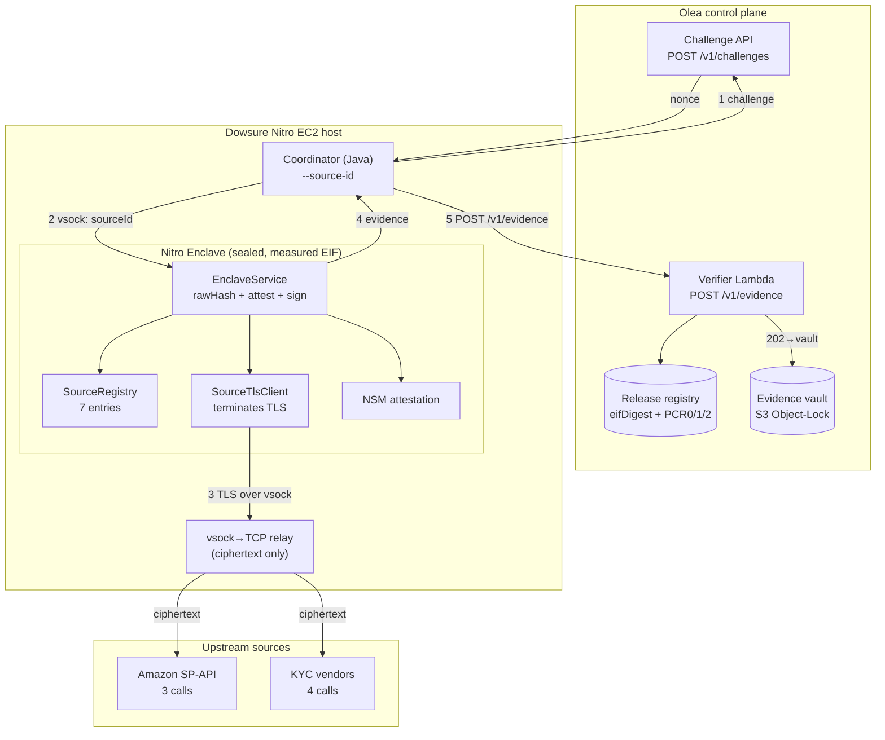

# Architecture diagram

> Reflects the current live path: **TLS-in-TEE**. The Nitro enclave opens and
> terminates TLS to each upstream source itself. The host is a transparent
> vsock→TCP byte relay that only sees ciphertext. The previous MPC-TLS / TLSNotary
> approach (external notary + prover sidecar) is historical reference only — see
> `archive/TLSNOTARY.md`.

## What the diagram means (TLS-in-TEE walkthrough)

1. The **Coordinator** (Java, running on the Nitro EC2 host) requests a challenge
   nonce from Olea's Challenge API (`POST /v1/challenges`), scoped by `sourceId`.

2. The Coordinator sends the `sourceId`, nonce, and `eifDigest` to the **enclave**
   over vsock (4-byte big-endian length-prefix framing).

3. Inside the enclave, the **SourceRegistry** resolves the `sourceId` to a host,
   path, and headers. The **SourceTlsClient** opens and terminates a TLS connection
   to the upstream source — the TLS handshake, encryption, and decryption all happen
   inside the enclave. The connection is routed through the host's **vsock→TCP relay**,
   which forwards raw ciphertext bytes without inspecting or modifying them.

4. The enclave receives the plaintext response `R`, computes
   `rawHash = SHA256(R)`, runs the transform (currently pass-through), generates an
   ephemeral P-256 key, binds `{requestId, nonce, policyVersion, sourceId, rawHash,
   transformedHash, publicKey}` into `user_data`, and requests NSM attestation. The
   enclave signs the evidence manifest and returns the full evidence package to the
   Coordinator.

5. The Coordinator signs the submission envelope and POSTs the combined evidence to
   Olea's Verifier (`POST /v1/evidence`). The Verifier checks: nonce freshness and
   single-use; PCR0/1/2 against the registered release; attestation COSE signature
   and certificate chain to AWS Nitro Root-G1; `user_data` binding; enclave
   signature; Dowsure submission signature. On success → **202 ACCEPTED** →
   evidence written to the S3 Object-Lock vault.

## Current reality — 7×202 ACCEPTED

All 7 source calls have been proven live via `oracle.oleainternal.com`:

- **Amazon SP-API (3):** getOrderMetrics, listFinancialEventGroups, listTransactions
- **KYC vendors (4):** alicloudTelThree, qichachaEnterpriseVerify, qichachaShixinCheck, gutuPanoramaChecks

Enclave: `olea-orders-tlsintee-f`, CID 16, non-debug (Flags: NONE).
EIF SHA-256 and PCR values are in
[PROJECT_STATUS_MATRIX.md](./PROJECT_STATUS_MATRIX.md#verified-facts-authoritative--copy-from-here).

The flow is fail-closed: any broken seal (nonce, PCRs, attestation signature,
enclave signature, Dowsure signature) rejects the submission.
