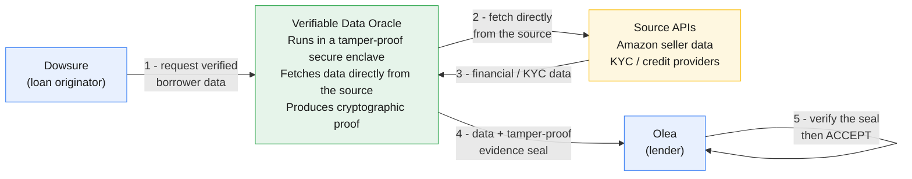

# Verifiable Data Oracle — Business Brief for Dowsure

## How it works (business view)



1. **Dowsure requests** verified data for a borrower.
2. The **Oracle** — inside a tamper-proof secure enclave — fetches that data **directly**
   from the source. No one in the middle can read or change it.
3. The source returns the **real data**.
4. The Oracle wraps it in a **tamper-proof evidence seal**.
5. **Olea verifies the seal** and accepts the data — or rejects it automatically if
   anything doesn't line up.

Dowsure keeps pulling data from Amazon/KYC providers exactly as it does today. What's
new is the thin Olea API layer that turns each data point into *provable* data.

---

## The Olea Oracle API — the heart of the integration

This is the part that matters for Dowsure: **the Olea API Dowsure integrates with.**
Three moves per data point — **(1) get a challenge → (2) run the Oracle → (3) submit the
evidence.** Dowsure codes steps 1 and 3; the Oracle (Olea's signed software) does step 2.

### Step 1 — Request a challenge

```http
POST https://oracle.oleainternal.com/v1/challenges
Content-Type: application/json

{
  "requestId": "7e7e04ee-9751-4fc7-9d73-1172105e0487",
  "sourceId": "getOrderMetrics",
  "policyVersion": "v1.0"
}
```

Olea returns a fresh, signed, time-limited challenge (`201 Created`):

```json
{
  "requestId": "7e7e04ee-9751-4fc7-9d73-1172105e0487",
  "nonce": "dGhpcyBpcyBhIDMyLWJ5dGUgcmFuZG9tIG5vbmNl",
  "policyVersion": "v1.0",
  "sourceId": "getOrderMetrics",
  "endpointScope": ["getOrderMetrics"],
  "issuedAt":  "2026-10-06T02:15:00.000Z",
  "expiresAt": "2026-10-06T02:20:00.000Z",
  "challengeSignature": "MEUCIQ..."
}
```

The `nonce` is the one-time anti-replay token — it must reappear, unchanged, in the
evidence submitted at step 3.

### Step 2 — Run the Oracle (one command)

The Oracle fetches the data over its own secure connection and produces the complete
evidence package. In the proof-of-concept this is a single command:

```bash
oracle-coordinator \
  --olea-url   https://oracle.oleainternal.com \
  --source-id  getOrderMetrics \
  --request-id 7e7e04ee-9751-4fc7-9d73-1172105e0487
```

Dowsure never assembles the cryptographic fields by hand — the Oracle produces them.

### Step 3 — Submit the evidence

```http
POST https://oracle.oleainternal.com/v1/evidence
Content-Type: application/json

{
  "requestId": "7e7e04ee-9751-4fc7-9d73-1172105e0487",
  "evidenceId": "a1b2c3d4-...",
  "nonce": "dGhpcyBpcyBhIDMyLWJ5dGUgcmFuZG9tIG5vbmNl",
  "sourceId": "getOrderMetrics",
  "policyVersion": "v1.0",

  "rawPayload":         { "...": "the exact data the source returned" },
  "transformedPayload": { "...": "what Olea consumes (pass-through today)" },

  "rawPayloadDigest":         "3b785acc...   (fingerprint of the source data)",
  "transformedPayloadDigest": "b0105642...",
  "manifestDigest":           "9f86d081...",

  "attestationDocument":     "hEShATgi...  (hardware proof the enclave produced this)",
  "attestedPublicKeyBase64": "MFkwEwYH...",
  "enclaveSignature":        "MEQCIE...",
  "submissionSignature":     "MEUCIQ...   (Dowsure's own signature)",

  "eifDigest": "a837d673...  (identity of the approved Oracle software)",
  "pcr0": "c5e703f0...", "pcr1": "4b4d5b36...", "pcr2": "9ab33673..."
}
```

Olea verifies every field automatically and returns a receipt (`202 Accepted`):

```json
{
  "evidenceId": "a1b2c3d4-...",
  "requestId":  "7e7e04ee-9751-4fc7-9d73-1172105e0487",
  "status":     "ACCEPTED",
  "reasonCode": "SUCCESS",
  "acceptedAt": "2026-10-06T02:16:31.000Z"
}
```

**`202 ACCEPTED` is the whole point** — Olea has cryptographically confirmed the data is
genuine, unaltered, and produced by approved software. Any failed check returns a
rejection with a specific reason instead, and the data is not accepted.

### Minimal integration sketch (pseudocode)

```python
# Dowsure side — the full loop per data point
challenge = POST("/v1/challenges",
                 {"requestId": rid, "sourceId": "getOrderMetrics", "policyVersion": "v1.0"})

evidence  = run_oracle(source_id="getOrderMetrics",       # Oracle fetches + seals
                       request_id=rid, nonce=challenge["nonce"])

receipt   = POST("/v1/evidence", evidence)                # submit the sealed package

assert receipt["status"] == "ACCEPTED"                    # 202 = trusted data
```

That's the entire integration: **challenge → run Oracle → submit → ACCEPTED.** The seven
data points differ only by `sourceId`.

---

## The seven data points tested (mocked or sandbox) today

Each is one `sourceId` in the API above:

| `sourceId` | Source | What it tells Olea |
|---|---|---|
| `getOrderMetrics` | Amazon | Seller sales volume / order counts |
| `listFinancialEventGroups` | Amazon | Settlement / payout groupings |
| `listTransactions` | Amazon | Individual financial transactions |
| `alicloudTelThree` | Alicloud | Phone / identity verification |
| `qichachaEnterpriseVerify` | Qichacha | Company registration / identity |
| `qichachaShixinCheck` | Qichacha | Adverse credit / default listing |
| `gutuPanoramaChecks` | Gutu | Legal / judicial background check |

---

## What the "evidence seal" guarantees

Each sealed data point carries proof of four things Olea checks automatically:

| Guarantee | Plain meaning |
|---|---|
| **Origin** | The data really came from the named source, fetched over a secure connection the Oracle made itself. |
| **Integrity** | The data was not altered after it was fetched — not by Dowsure, not by anyone on the network. |
| **Approved software** | Only the exact, approved Oracle software processed the data (any change is detectable and rejected). |
| **Freshness** | Each request is one-time-use and time-limited, so old results can't be replayed as new. |

**Key point for Dowsure:** even though Dowsure operates the environment, Dowsure
**cannot** change the data between fetch and delivery without Olea's checks failing. This
protects Dowsure too — it's provable that Dowsure delivered exactly what the source
returned, which removes any "did Dowsure massage the numbers?" question from the
relationship.

---

## Where things stand

- **Status:** All 7 data calls are proven end-to-end in a proof-of-concept environment —
  every one returned an **ACCEPTED** verification result.
- **Next:** Confirm the production hosting split (Dowsure hosts the Oracle on its own
  infrastructure; Olea provides and reviews the approved software), then move from the
  sandbox sources to the real production source APIs.

---

*Questions on this brief can go to the Olea team. A deeper technical walkthrough
(step-by-step flow, field-level detail, full architecture) is available on request.*
