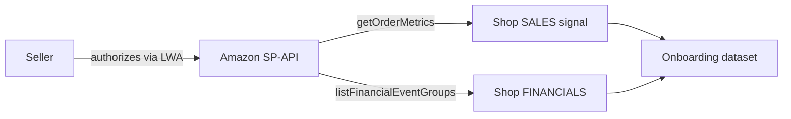
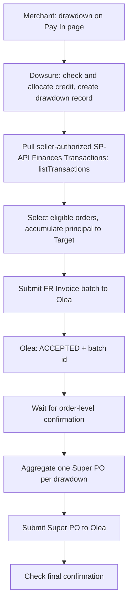
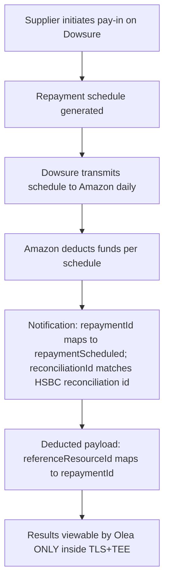
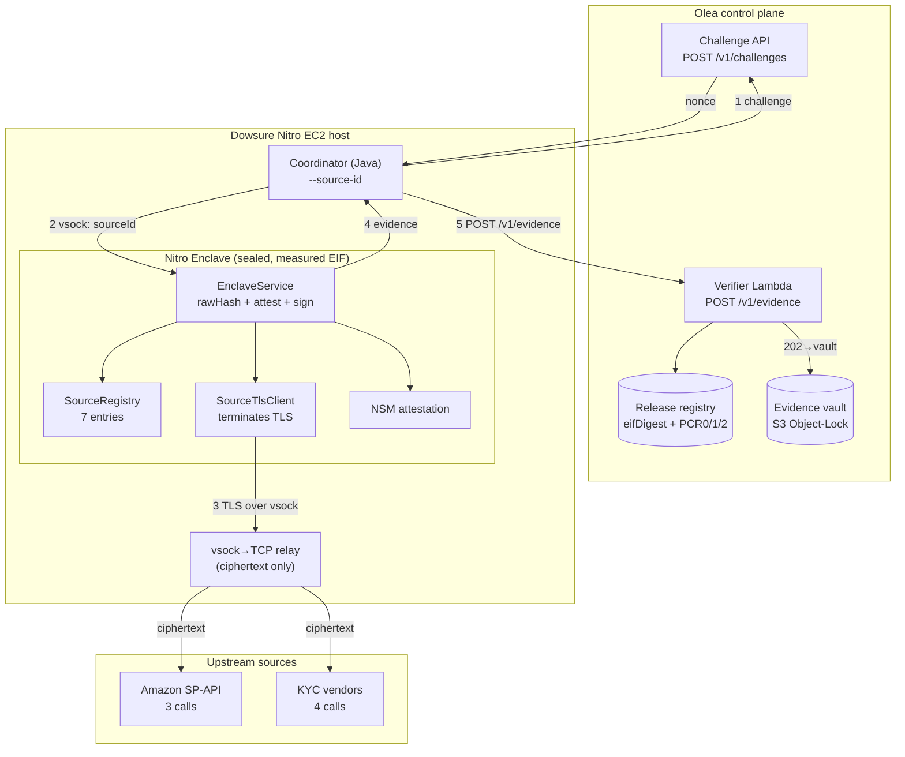
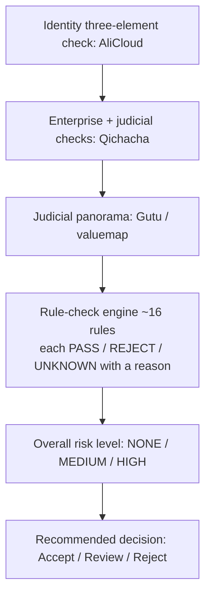

# Flows - how everything actually works, end to end

> **Read this first (plain English).** This is the heart of the documentation. It
> walks through every flow in the Olea-Dowsure oracle in order, in plain language,
> with a diagram and a numbered step list for each. Every part is tagged so you
> always know what is real today versus what is planned. There are five flows:
> (1) a seller joins (Shop Onboarding), (2) a seller borrows against orders
> (Super PO), (3) the loan is repaid (Repayment — and why it must run inside a
> tamper-proof enclave), (4) the trust machinery that signs a verifiable receipt
> (TLS-in-TEE attestation — the enclave terminates TLS itself), and (5) checking
> who the borrower is (KYC). All 7 source calls (3 Amazon SP-API + 4 KYC) have
> been proven live with 202 ACCEPTED. For the hard status facts (enclave
> fingerprints, host, verified IDs, evidence IDs) see the
> [project status matrix](./PROJECT_STATUS_MATRIX.md); this page links there rather
> than repeating those numbers. For where the data comes from, see
> [source endpoints](./SOURCE_ENDPOINTS.md).

**Cross-check note.** Every flow on this page was traced against the actual code
(`coordinator/.../Coordinator.java`, `nitro-enclave/.../EnclaveMain.java`,
`nitro-enclave/.../EnclaveService.java`) and the integration references. The
authoritative technical anchors are: **CID 16**, the **current EIF
(Enclave Image File)**, and **TLS-in-TEE** — the enclave opens and terminates its
own TLS connection to each source (the external MPC-TLS/TLSNotary approach is now
historical reference, off the live path). If prose and code ever disagree, the
code wins and this page is wrong.

## Legend

- **IMPLEMENTED** - built and working in this repository today.
- **PLANNED** - designed and disclosed, but not yet built here.
- **BLOCKED** - cannot proceed yet because of an external or contractual
  dependency.

## Acronyms used on this page (expanded on first use)

- **Nitro Enclave** - an isolated, tamper-proof virtual machine inside an AWS EC2
  host, with no persistent storage, no interactive login, and no network except a
  virtual socket to its parent host.
- **EIF (Enclave Image File)** - the single built artifact that boots inside the
  enclave; its SHA-256 hash is the enclave's identity.
- **PCR (Platform Configuration Register)** - a measurement (hash) of what was
  loaded into the enclave; PCR0/1/2 together fingerprint the exact EIF.
- **attestation** - a signed document the enclave produces proving which EIF is
  running and binding a public key to that enclave.
- **COSE (CBOR Object Signing and Encryption)** - the signature format of the
  attestation document.
- **CBOR (Concise Binary Object Representation)** - the compact binary encoding
  COSE uses.
- **TLS-in-TEE** - the enclave opens and terminates its own TLS connection to
  the upstream source; the host is a transparent vsock→TCP byte relay carrying
  only ciphertext. No external notary is involved.
- **TLSNotary / MPC-TLS** - the previous approach (now historical reference): a
  protocol producing a proof that a specific HTTPS response really came from a
  specific server, using a separate prover + independent notary.
- **TEE (Trusted Execution Environment)** - a protected area (here, the Nitro
  Enclave) where code and data cannot be read or tampered with from outside.
- **vsock (virtual socket / AF_VSOCK)** - the only communication channel between
  the enclave and its parent host.
- **SP-API (Selling Partner API)** - Amazon's seller data API.
- **LWA (Login with Amazon)** - the seller sign-in / authorization step.
- **Super PO (Super Purchase Order)** - one aggregated financing record grouping
  many underlying orders from a single drawdown.
- **FR Invoice (Financing Request Invoice)** - the order-level financing request
  batch Dowsure submits to Olea.
- **KYC (Know Your Customer)** - identity, enterprise, and judicial checks on a
  borrower.
- **NSM (Nitro Security Module)** - the hardware component that signs the
  attestation document.

---

## Flow (1): Shop Onboarding

**What it is:** a seller authorizes Amazon access so Dowsure can read their shop's
sales and financial history.

**Steps:**

1. The seller completes LWA (Login with Amazon) so Dowsure can read that seller's
   SP-API (Selling Partner API) data on their behalf.
2. **Shop sales** come from Order Metrics (`getOrderMetrics`). This is the bounded
   path the enclave currently models as the mock `GET_ORDERS` test. **[IMPLEMENTED
   as a bounded mock probe]**
3. **Shop financials** come from Financial Event Groups
   (`listFinancialEventGroups`). Wiring this live is **[PLANNED]**.
4. Live validation against the real Amazon sandbox is now **possible** - the
   Amazon SP-API sandbox and its credentials are available (see
   [status matrix](./PROJECT_STATUS_MATRIX.md)). This is no longer blocked.

**Status:** the Order Metrics probe path is **IMPLEMENTED** and proven live
(202 ACCEPTED, evidenceId `7e7e04ee`); Financial Event Groups is proven live
(202 ACCEPTED, evidenceId `3b785acc`); live sandbox validation is **done**.

**Open questions:**

- Which SP-API operation maps to which onboarding dataset is **pending Dowsure
  confirmation**.
- Onboarding examples for the two named sample suppliers (*Quanzhou Feile
  E-commerce Co., Ltd* and *Xiamen Yunyu Tianji Network Technology Co., Ltd* -
  **test-case labels only**) are still outstanding.

For the field-level source map, see [source endpoints](./SOURCE_ENDPOINTS.md#1-the-source-map-four-data-categories-plus-kyc).

---

## Flow (2): Financing Request and Super PO

**What it is:** a seller borrows (a "drawdown") against their orders; Dowsure
selects eligible orders, submits them to Olea, and aggregates them into one Super
PO (Super Purchase Order).

**Steps:**

1. The merchant initiates a **drawdown** on the Pay In page.
2. Dowsure checks available credit, allocates the amount across stores, and creates
   a **drawdown record**.
3. Dowsure pulls seller-authorized SP-API **Finances Transactions**
   (`listTransactions`) - order IDs, amounts, currencies, shipping, posting dates.
4. Dowsure selects eligible orders and accumulates principal up to the `Target`
   using the eligibility formula. The full formula and worked example live in
   [source endpoints](./SOURCE_ENDPOINTS.md#3-super-po-eligibility-formula-recorded-exactly);
   in short, orders are added until `sum(EligiblePrincipal) >= Target`, and if the
   selected orders do not cover the target, Dowsure does not submit a batch that
   cycle.
5. Dowsure submits an **FR Invoice (Financing Request Invoice)** batch to Olea and
   receives `ACCEPTED` plus a batch id.
6. Dowsure waits for **order-level confirmation**.
7. Dowsure aggregates **one Super PO per drawdown** (Super PO id, total order
   amount, total financing amount, currency, buyer, seller, linked order ids).
8. Dowsure submits the Super PO and checks the final confirmation. `ACCEPTED` means
   received; the Super PO is confirmed only after final processing succeeds.

**Relationship:** one drawdown -> one Super PO -> multiple order-level records.

**Status:** **PLANNED.** The business logic has been disclosed by Dowsure but is
not yet implemented in this repository.

---

## Flow (3): Repayment, and WHY it is TEE-only

**What it is:** the seller repays the financing; Amazon deducts funds on a schedule.
The critical point is *why* Olea can only observe this inside a tamper-proof
enclave.

> **This is a HARD CONTRACTUAL requirement, not an optimization.** The Amazon
> repayment-plan API is **PRIVATE**. Amazon does **NOT** allow Dowsure to share it
> with any third party, and Dowsure cannot expose an API to forward the data to
> Olea. Olea can **ONLY** view repayment results inside a **TLS+TEE (Trusted
> Execution Environment)**. That is what makes the Nitro Enclave mandatory for this
> category.

**Steps:**

1. A supplier initiates a pay-in on Dowsure; a **repayment schedule** is generated.
2. Dowsure transmits the repayment schedule to Amazon on a **daily** basis.
3. Amazon **deducts funds** in accordance with the amounts in the schedule.
4. A **notification** signals that Amazon has begun processing a repayment:
   `repaymentId` in the notification is the `repaymentScheduled` in the repayment
   schedule, and `reconciliationId` can be matched with HSBC's reconciliation id.
5. A **deducted payload** signals the deduction has been processed:
   `referenceResourceId` in the payload is the `repaymentId` from the notification.
6. Because the repayment-plan API is private, Olea observes these results **only**
   inside the TLS+TEE enclave.

> **Note on the source reference:** the repayment integration reference contains a
> typo, "TLE+TEE". The correct term is **TLS+TEE**, as used throughout this page.

**Status:** **BLOCKED / PLANNED** - this flow depends on the contractual TLS+TEE
arrangement and the private Amazon repayment-plan API; it is not implemented in
this repository.

---

## Flow (4): TLS-in-TEE / Nitro attestation trust flow

**What it is:** the machinery that turns "we fetched some data" into "here is a
cryptographic receipt Olea can verify." The enclave terminates TLS itself — source
authenticity and execution trust are collapsed into a single enclave boundary. The
previous MPC-TLS/TLSNotary approach (external notary + prover sidecar) is historical
reference only, off the live path.

**Steps:**

1. The Coordinator (Java, `Coordinator.java`, driven by `--source-id`) obtains a
   **challenge nonce** from Olea (`POST /v1/challenges`, scoped by `sourceId`).
   **[IMPLEMENTED — proven live, 7 sources]**
2. The Coordinator sends `{sourceId, nonce, eifDigest}` to the **enclave** over
   vsock (4-byte big-endian length-prefix framing). **[IMPLEMENTED]**
3. Inside the enclave, the **SourceRegistry** resolves the `sourceId` to a host,
   path, and headers. **[IMPLEMENTED — 7 entries]**
4. The **SourceTlsClient** opens and terminates a TLS connection to the upstream
   source. The connection is routed through the host's **vsock→TCP relay**, which
   forwards raw ciphertext bytes without inspecting or modifying them. The host
   never sees plaintext. **[IMPLEMENTED]**
5. The enclave receives the plaintext response `R`, computes
   `rawHash = SHA256(R)`, and runs the **transform** (currently pass-through).
   **[IMPLEMENTED]**
6. The enclave generates an **ephemeral P-256 key** and binds request metadata into
   `user_data` `{requestId, nonce, policyVersion, sourceId, rawHash,
   transformedHash, publicKey}`. No `tlsProofHash` — there is no external TLS
   proof. **[IMPLEMENTED]**
7. The **NSM (Nitro Security Module)** produces a **Nitro attestation** over the
   canonical binding and the attested public key. **[IMPLEMENTED]**
8. The enclave signs the evidence manifest and returns the package to the
   Coordinator. **[IMPLEMENTED]**
9. The Coordinator signs the submission envelope and POSTs to **Olea's Verifier**
   (`POST /v1/evidence`). **Olea verifies**: nonce freshness and single-use;
   PCR0/1/2 against the registered release; COSE signature and certificate chain to
   AWS Nitro Root-G1; `user_data` binding; enclave signature; Dowsure submission
   signature. **[IMPLEMENTED]**
10. On success → **202 ACCEPTED** → evidence written to the S3 Object-Lock vault.
    **[DONE — 7×202 ACCEPTED, all sources proven live]**

**What is open:**

- Production hardening: config delivery (baked for PoC → attested KMS/Secrets Manager
  for production). **[PLANNED]**
- Verifier Lambda sync with CloudFormation (`sam deploy` pending). **[PLANNED]**
- Real business transforms (currently pass-through). **[PLANNED]**

**Facts:** the enclave fingerprints (EIF SHA-256, PCR0/1/2), the host, and the
7 evidence IDs are recorded once in
[the status matrix](./PROJECT_STATUS_MATRIX.md#verified-facts-authoritative--copy-from-here)
and are not restated here. See also the
[architecture diagram](./ARCHITECTURE_DIAGRAM.md).

---

## Flow (5): KYC (Phase-2 TLS+TEE consumer)

**What it is:** the checks that confirm who a borrower is and whether they carry
legal risk. This is documented at **schema / flow / decision-model level only** -
not as code integration.

**Steps:**

1. **Identity three-element check** (AliCloud) - confirm that `<name>`,
   `<idNumber>`, and `<phone>` belong together.
2. **Enterprise + judicial checks** (Qichacha) - enterprise existence and status,
   plus `ShixinCheck` (dishonest), `ZhixingCheck` (enforcement), `SumptuaryCheck`
   (high-consumption restriction), and `BankruptcyCheck`, keyed off the business
   `<creditCode>`.
3. **Judicial panorama** (Gutu / valuemap) - a broader judicial-risk picture.
4. **Rule-check engine** runs about **16 rules**, each returning
   PASS / REJECT / UNKNOWN with a reason:
   - **1.1-1.4** identity / age,
   - **2.1-2.5** enterprise consistency / status / term,
   - **3.1-3.4** dishonest / enforcement / high-consumption / bankruptcy,
   - **4.1-4.2** unresolved-enforcement count / amount.
5. The results feed an **overall risk level**: NONE / MEDIUM / HIGH.
6. The risk level yields a **recommended decision**: Accept / Review / Reject.

> **Placeholders only.** Any KYC example uses `<name>`, `<idNumber>`,
> `<creditCode>`, `<phone>` - never a real national ID, phone number, name, company
> credit code, or case detail.

**Status:** the **4 KYC source calls are proven live** through the TLS-in-TEE path
(202 ACCEPTED each): `alicloudTelThree` (`d07f6de7`), `qichachaEnterpriseVerify`
(`ac87b0ba`), `qichachaShixinCheck` (`e8c25235`), `gutuPanoramaChecks`
(`71da25ed`). The **rule-check engine** (the ~16-rule decision model above) remains
**PLANNED (Phase 2)** — it is documented here at decision-model level only, not yet
built as code. See the KYC row in
[source endpoints](./SOURCE_ENDPOINTS.md#1-the-source-map-four-data-categories-plus-kyc).

---

## See also

- [SOURCE_ENDPOINTS.md](./SOURCE_ENDPOINTS.md) - the source map and the Super PO
  eligibility formula.
- [PROJECT_STATUS_MATRIX.md](./PROJECT_STATUS_MATRIX.md) - the single source of
  truth for status facts.
- [ARCHITECTURE_DIAGRAM.md](./ARCHITECTURE_DIAGRAM.md) - the trust-path diagram.
