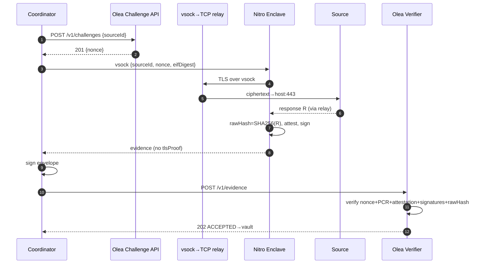

# Olea–Dowsure Oracle — Sequence, Payload Fields & Tamper-Evidence

Authoritative, maintainable source for the end-to-end sequence diagram, the payload
field reference, and the anti-tamper model. Reflects the **TLS-in-TEE** architecture:
the enclave opens and terminates TLS to each upstream source itself. The previous
MPC-TLS/TLSNotary approach (external notary + prover sidecar) is historical reference
only — see `archive/TLSNOTARY.md`.

For who-hosts-what see `flow-steps/diagram-production-topology.md`; for the flow prose see `FLOWS.md`.

---

## End-to-end sequence

---

## Payload fields

### The origin anchor — rawHash

In TLS-in-TEE, the enclave terminates TLS itself and receives the plaintext
response `R` directly. There is no external notary and no notary-specific
`revealed_recv_b64` field. The enclave computes `rawHash = SHA256(R)` over the
response bytes it received, and that hash is the origin anchor — it is bound into
the attestation `user_data` and verified by Olea. The wire bytes themselves still
travel in the submission as `rawResponseB64` (base64 of `R`); the verifier
re-hashes them (`SHA256(decode(rawResponseB64)) == rawPayloadDigest`) as an
independent integrity check.

### Attestation binding (`user_data`)

`{requestId, nonce, policyVersion, sourceId, rawHash, transformedHash, publicKey}`

- No `tlsProofHash` — there is no external TLS proof in TLS-in-TEE.
- Uses `sourceId` (not `source` / `endpoint`).
- Signed inside the enclave; immutable after attestation.

### Submitted evidence (`POST /v1/evidence`)

`rawPayload` / `rawPayloadDigest` (= `rawHash`), `transformedPayload` / `digest`,
`attestationDocument`, `attestedPublicKeyBase64`, `enclaveSignature`, `manifestDigest`,
`submissionEnvelope` / `submissionSignature`, `eifDigest`, `pcr0` / `pcr1` / `pcr2`,
`sourceId`.

Fields **removed** from the previous MPC-TLS approach (no longer in the manifest):
`tlsProofType`, `tlsProofHash`, `tlsProofResponseHash`, `tlsProof`,
`revealed_recv_b64`. (`rawResponseB64` is **kept** — it carries the wire bytes the
verifier re-hashes against `rawPayloadDigest`.)

### Coordinator invocation

The Coordinator is driven by `--source-id`. The previous flags
`--raw-payload-file`, `--raw-response-b64-file`, `--tls-proof-file` are no longer
used — the enclave fetches the source data itself.

---

## How tampering is prevented (fail-closed at every step)

1. **One-time nonce** — identical in attestation `user_data` and submission; single-use (`NONCE_MISMATCH` / `CHALLENGE_REPLAY`).
2. **TLS-in-TEE seal (source + execution in one boundary)** — the enclave terminates TLS itself, so the plaintext response is never exposed outside the enclave. `rawHash = SHA256(R)` is the origin anchor. Any attempt to substitute data after the enclave receives it would require breaking TLS or the enclave boundary.
3. **TEE seal (integrity)** — COSE-signed attestation chains to the genuine AWS Nitro root (fingerprint `64:1A:03:…:BB:5B`); PCR0/1/2 must equal the registered ACTIVE release (`PCR_MISMATCH` / `EIF_REVOKED`).
4. **Attestation binds the facts** — `user_data` mismatch → `ATTESTATION_BINDING_INVALID`.
5. **Key binding** — attested `public_key` == `attestedPublicKeyBase64`; `enclaveSignature` verifies with it.
6. **Dowsure authenticity** — `submissionSignature` verifies against the release's registered `dowsurePublicKeyPem` (`DOWSURE_SIGNATURE_INVALID`).
7. **Manifest integrity** — `manifestDigest` and envelope canonical shape must match (`MANIFEST_HASH_MISMATCH` / `SUBMISSION_ENVELOPE_INVALID`).
8. **Durable record** — accepted evidence written to S3 Object-Lock (COMPLIANCE); immutable.

**Bottom line:** no single party can forge a passing submission. The enclave
terminates TLS and produces the attestation — Dowsure cannot see or alter the
plaintext response because TLS terminates inside the enclave; the host relays only
ciphertext. Olea verifies all seals; the nonce makes every receipt one-time.

### Comparison with the previous MPC-TLS approach

In the previous approach, source authenticity was proven by an external TLSNotary
proof (`tlsProofHash`, `tlsProofResponseHash`), and the enclave verified
`rawHash == tlsProof.responseHash` as a "same-bytes bridge." In TLS-in-TEE, that
bridge is unnecessary — the enclave receives the plaintext directly over its own
TLS session, so `rawHash` is the origin anchor without any external proof to
cross-check against. This is a simpler and stronger trust model: source
authenticity and execution trust are collapsed into a single enclave boundary.
