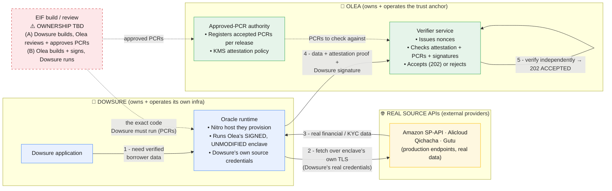

# Production Topology Diagrams — Dowsure-owned infra vs. our PoC

The step diagrams (`diagram-business.md`, `diagram-technical.md`) show the **PoC
topology**, where we stood up every component ourselves and pointed the enclave at
**mock** source APIs. In the real engagement the ownership boundary is different:

> From `ENGAGEMENT_CONTEXT.md`: *"Amazon on the left, a **Dowsure-hosted environment**
> in the middle, **Olea** verifying at the bottom."*

- **Dowsure owns and operates** the middle: the Nitro-enabled EC2 host, the Coordinator,
  the `vsock-proxy` egress relays, their own source credentials, and the egress path to
  the **real** source APIs. If Dowsure hosts the enclave, Dowsure provisions the host and
  runs **Olea's exact unmodified signed EIF** (any change alters the PCRs and KMS
  withholds the signing key — enforced technically, not by trust).
- **Olea owns and operates** the **verifier** (challenges / evidence / releases API +
  DynamoDB + evidence vault) and the KMS key with its attestation-gated policy, and acts
  as the **approved-PCR authority** — Olea registers which PCRs are accepted.
- **The source APIs** (Amazon SP-API, Alicloud, Qichacha, Gutu) are **real external
  providers**, reached over the public internet with Dowsure's real credentials.

> **Hosting — decided:** **Dowsure hosts the Nitro enclave** on its own
> infrastructure. Olea does **not** run the enclave in production.
>
> **EIF build/review ownership — NOT YET DECIDED.** Who *builds* the EIF versus who
> *reviews + approves* its PCRs is still open. The two live options:
> - **(A)** Dowsure builds the EIF; Olea reviews the source/build and registers the
>   approved PCRs (Olea = reviewer + PCR authority).
> - **(B)** Olea builds and signs the EIF; Dowsure runs it unmodified.
>
> Either way the **integrity guarantee is identical** — the registered PCRs lock the
> exact code, and KMS withholds the signing key unless the running PCRs match. The
> diagrams below mark the EIF build box as **TBD** and show the **Dowsure-hosted**
> runtime (the decided part).

---

## 1. Production business-level flow



**The key trust property:** even though **Dowsure runs the oracle on its own infra**,
Dowsure **cannot tamper** with the data or the code. Olea builds the enclave image and
records its PCRs; Dowsure must run that *exact* image or the attestation won't match
Olea's registered PCRs and the KMS key won't release. So Olea gets a trustworthy result
from infrastructure it does not control.

---

## 2. Production technical component diagram (Dowsure-hosted enclave)

```mermaid
graph TB
    subgraph DOWSURE["🏢 DOWSURE AWS ACCOUNT (Dowsure-owned + operated)"]
        subgraph DHOST["Nitro-enabled EC2 host (Dowsure provisions)"]
            COORD["Coordinator<br/>• Drives flow<br/>• Signs envelope (Dowsure key)<br/>• Cannot read enclave plaintext"]
            RELAY["vsock-proxy (egress relays)<br/>one per real provider host:443"]
            PROLE["Parent IAM role<br/>• permission to call Olea's KMS key<br/>for attested signing"]
        end
        subgraph DENCLAVE["Nitro Enclave (OLEA's signed EIF, unmodified)"]
            ESVC["EnclaveService<br/>• terminates TLS to real sources<br/>• Dowsure's source credentials injected<br/>• hashes + attests + signs"]
        end
        DCREDS["Dowsure source credentials<br/>(real Amazon/KYC secrets)"]
    end

    subgraph SOURCES["🌐 REAL SOURCE APIs"]
        AMZ["Amazon SP-API<br/>sellingpartnerapi-na.amazon.com"]
        KYC["Alicloud / Qichacha / Gutu<br/>(real provider endpoints)"]
    end

    subgraph OLEA["🏦 OLEA AWS ACCOUNT (Olea-owned + operated)"]
        APIGW["Verifier API Gateway"]
        LAMBDA["Verifier Lambda<br/>challenges · evidence · releases"]
        DDB["DynamoDB<br/>Challenge · Release · Policy · Receipt"]
        S3["Evidence vault S3 (KMS-encrypted)"]
        KMS["KMS key<br/>• attestation-gated policy<br/>• condition: PCR0 == approved"]
        PCRREG["Approved-PCR registry<br/>• records PCR0/1/2 per release<br/>• registers ACTIVE release<br/>(Olea = PCR authority)"]
    end

    BUILD["EIF build / review<br/>⚠️ OWNERSHIP TBD<br/>(A) Dowsure builds, Olea reviews<br/>(B) Olea builds + signs"]

    COORD <-->|AF_VSOCK<br/>len-prefix frames| ESVC
    ESVC <-->|AF_VSOCK| RELAY
    DCREDS -.->|injected into enclave<br/>(scoped credential)| ESVC
    RELAY <-->|TCP/TLS (ciphertext only)| AMZ
    RELAY <-->|TCP/TLS (ciphertext only)| KYC
    COORD <-->|HTTPS| APIGW
    APIGW --> LAMBDA
    LAMBDA <--> DDB
    LAMBDA --> S3
    PROLE -.->|attested KMS Sign<br/>(key released only if<br/>PCR0 matches)| KMS
    ESVC -.->|attestation doc rides<br/>along KMS Sign| KMS
    BUILD -.->|signed EIF<br/>Dowsure runs unmodified| DENCLAVE
    BUILD -.->|approved PCRs| PCRREG

    classDef dowsure fill:#e8f0fe,stroke:#4285f4,color:#1a1a1a;
    classDef olea fill:#e6f4ea,stroke:#34a853,color:#1a1a1a;
    classDef src fill:#fef7e0,stroke:#fbbc04,color:#1a1a1a;
    classDef tbd fill:#fde7e9,stroke:#d13438,color:#1a1a1a,stroke-dasharray: 5 5;
    class COORD,RELAY,PROLE,ESVC,DCREDS dowsure;
    class APIGW,LAMBDA,DDB,S3,KMS,PCRREG olea;
    class AMZ,KYC src;
    class BUILD tbd;
```

---

## 3. What the PoC collapsed (for honesty)

| Concern | Production (Dowsure-owned) | Our PoC (what we actually ran) |
|---|---|---|
| **Who hosts the enclave** | Dowsure's AWS account, Dowsure-provisioned Nitro host | Our preprod account `706179786846`, host `i-0b2b6aa26fb920103` |
| **Who builds the EIF** | Olea (recorded PCRs per release) | We built it (EIF `a837d673…`, PCRs recorded) |
| **Source APIs** | **Real** Amazon SP-API / Alicloud / Qichacha / Gutu | **Mocks** (`097sqg03n1…`, `i8yde0kf2g…` API GW stages) |
| **Source credentials** | Dowsure's real provider secrets, injected via KMS-attested delivery | Single baked **mock** `x-api-key` (PoC `PocCredentialProvider`) |
| **KMS attestation gate** | Live — key released only when PCR0 matches | Not exercised (mocks need no provider secret) |
| **Verifier** | Olea-owned, Olea-operated | We stood it up in preprod (same code) |
| **Coordinator + verifier split** | Separate orgs / accounts (Dowsure ↔ Olea) | Both in our account, same operator |

**Why the PoC is still meaningful:** the mechanism that matters — the enclave
terminating TLS itself, binding the exact response bytes into a hardware attestation,
and the verifier rejecting anything whose PCRs/nonce/signatures/hashes don't line up —
is **identical** in both. The PoC proved the mechanism with 7×202 ACCEPTED. Production
only changes *who owns which box* and swaps mocks for real providers + the live KMS
attestation gate.

---

## 4. Can Dowsure tamper with the data? (the core question)

Dowsure hosts the enclave **and** runs the Coordinator, so Dowsure's host sees the
plaintext response and holds the evidence before it goes to Olea. **It can attempt to
modify the data, but Olea's verifier rejects any modification — fail-closed.**

The enclave seals the data into **two independent cryptographic bindings** *before* it
hands anything to the Coordinator (step 6 of the flow):

1. **Enclave signature** — `enclaveSignature = ECDSA(canonicalize(manifest), ephemeral_key)`,
   where the manifest carries `rawSourceHash` and `transformedHash`.
2. **Nitro attestation document** — AWS-signed, with
   `user_data = {requestId, nonce, policyVersion, sourceId, rawHash, transformedHash, publicKey}`.
   Only the Nitro hypervisor can produce it; the Coordinator cannot forge or alter it.

When Dowsure submits to `POST /v1/evidence`, the verifier re-derives everything
(`index.js:submitEvidence`):

```javascript
if (sha256(decode(rawResponseB64)) !== rawPayloadDigest)                    throw RAW_PAYLOAD_HASH_MISMATCH;
if (sha256(canonicalize(transformedPayload)) !== transformedPayloadDigest)  throw TRANSFORMED_PAYLOAD_HASH_MISMATCH;
if (sha256(canonicalize(buildManifest(body))) !== manifestDigest)           throw MANIFEST_HASH_MISMATCH;
verifyEnclaveSignature(body, manifest);              // ENCLAVE_SIGNATURE_INVALID
verifyNitroAttestation(..., {rawHash, transformedHash, ...});  // user_data must match
```

Every tampering path dead-ends:

| What Dowsure tries | Why Olea rejects it |
|---|---|
| Change `rawPayload` / `rawResponseB64` only | Re-hash ≠ `rawPayloadDigest` → `RAW_PAYLOAD_HASH_MISMATCH` |
| Change data **and** its digest to match | New digest ≠ the one sealed inside the **AWS-signed** attestation → attestation `user_data` mismatch |
| Change data + digest + re-sign the manifest | The enclave signing key is **ephemeral, generated inside the enclave** — Dowsure never has it; the attested public key won't verify a forged signature → `ENCLAVE_SIGNATURE_INVALID` |
| Regenerate the whole attestation | Only the Nitro hypervisor emits a valid doc, and it would carry **different PCRs** (or a key Dowsure controls) that don't match Olea's registered release → `PCR_MISMATCH` |

**What the Coordinator legitimately adds** is only the submission envelope + Dowsure's
own signature (authorization metadata) — it cannot touch the attested hashes.

**Honest caveat — availability, not integrity:** Dowsure *can* refuse to submit, drop a
request, or try to replay old evidence. It cannot produce *accepted-but-tampered* data.
Replay is separately blocked by the single-use, expiring nonce
(`CHALLENGE_REPLAY` / `SUBMISSION_REPLAY`). Completeness ("forward **all** relevant
traffic, no unnotarized side path") is a policy concern enforced by requiring every
source call to go through the enclave — it is not something the cryptography alone
guarantees.

**This is the whole point of TLS-in-TEE:** the data is sealed by hardware attestation
*before* it reaches infrastructure Olea doesn't control, so Olea can trust a result
that was fetched, processed, and signed on **Dowsure's** host.
