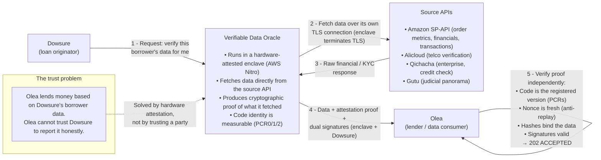
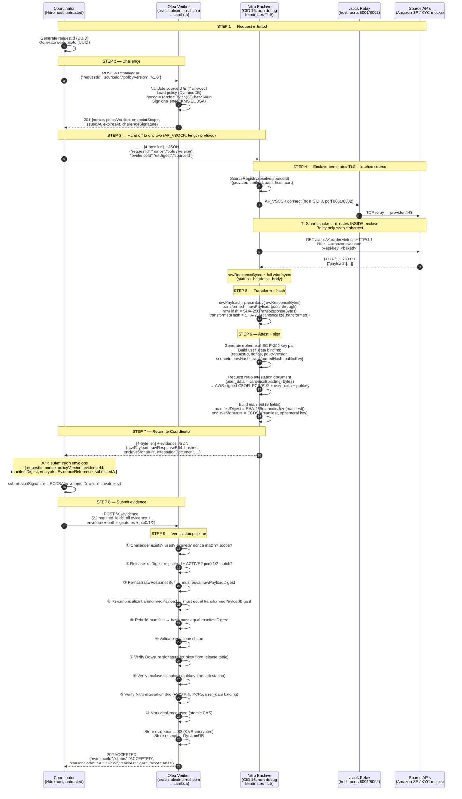
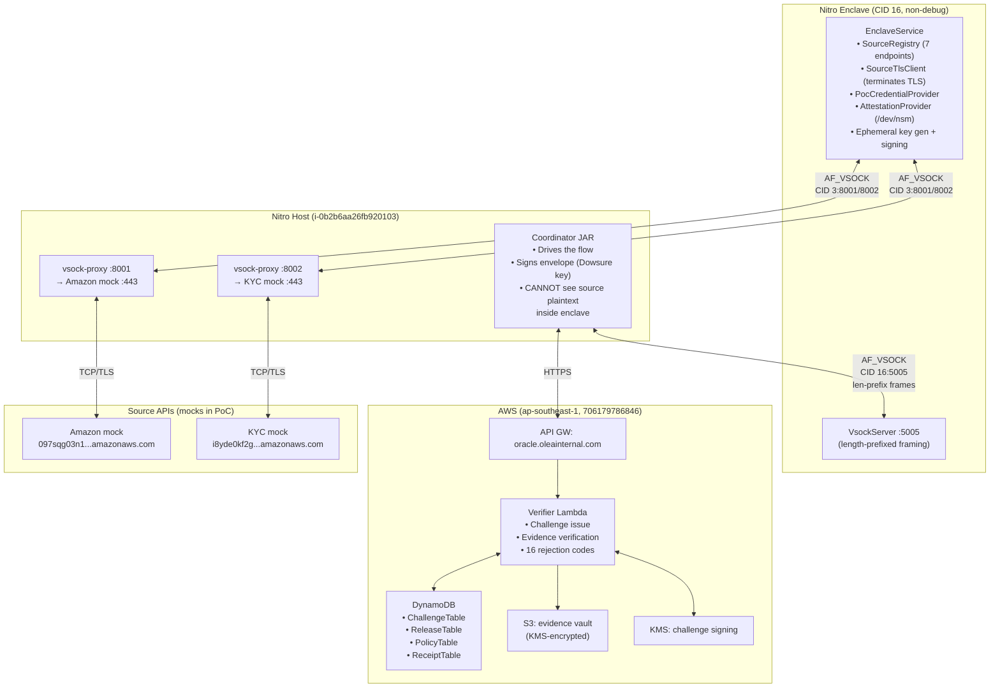

# TLS-in-TEE Oracle — Step-by-step flow (URLs, payloads, who/what/why)

End-to-end trace of one verifiable data request, from Dowsure's intent to Olea's
`202 ACCEPTED`. Every URL, field, and payload below is taken from the live code, not
illustrative. One file per step; read in order.

## The actors (who)

| Actor | Where it runs | Trust role |
|---|---|---|
| **Coordinator** | Nitro **host** (`i-0b2b6aa26fb920103`, preprod `706179786846`, `ap-southeast-1`) | Untrusted orchestrator. Drives the flow, holds Dowsure's signing key, but can **never see or alter** source plaintext — that happens inside the enclave. `coordinator/.../Coordinator.java` |
| **Nitro Enclave** | Isolated VM on the same host, **CID 16**, non-debug | The trusted party. Terminates TLS to the source **itself**, hashes the exact wire bytes, binds them to a hardware attestation, signs. `nitro-enclave/.../EnclaveService.java` |
| **vsock relay** | Host, ports **8001** (amazon mock) / **8002** (kyc mock) | Dumb ciphertext forwarder. The enclave has no NIC; the relay shuttles encrypted TLS bytes host↔provider. It sees only ciphertext. |
| **Source APIs** | Amazon SP-API + KYC providers (mocks in PoC) | The real data origin. |
| **Olea verifier** | Lambda behind API Gateway `oracle.oleainternal.com` | The consumer's gatekeeper. Issues nonces, checks attestation + PCRs + signatures + hash bindings, returns 202/4xx. `sam/olea/functions/verification/index.js` |

## Why TLS-in-TEE (and not a notary)

The old model used an external TLSNotary party to co-witness the TLS session via MPC
so nobody had to trust the enclave alone. **That party is gone.** Now the enclave
terminates TLS itself and the **Nitro attestation document** (PCR0/1/2 measuring the
exact code image) *is* the proof. Anyone can verify the measurements match a
registered, non-revoked release. The notary + sidecar code remains in the repo
(`docs/TLSNOTARY.md`, `tlsnotary-verifier.js`) as historical reference, **off the live
path**.

## The 7 source calls (`sourceId` → provider/method/path)

From `SourceRegistry.java` (ported verbatim from `coordinator/sources.py`):

| sourceId | provider | method | path |
|---|---|---|---|
| `getOrderMetrics` | amazon | GET | `/sales/v1/orderMetrics` |
| `listFinancialEventGroups` | amazon | GET | `/finances/v0/financialEventGroups` |
| `listTransactions` | amazon | GET | `/finances/2024-06-19/transactions` |
| `alicloudTelThree` | alicloud | GET | `/lundear/telThree` |
| `qichachaEnterpriseVerify` | qichacha | GET | `/EnterpriseInfo/Verify` |
| `qichachaShixinCheck` | qichacha | GET | `/ShixinCheck/GetList` |
| `gutuPanoramaChecks` | gutu | **POST** | `/api/v1/judicial/panorama-checks` |

## Live endpoints

- **Olea API (public, custom domain):** `https://oracle.oleainternal.com` — base-path
  mapped to the preprod stage of API GW `c8tw99zmla`. The custom domain exists to
  bypass VPC `execute-api` private-DNS interception that was 403-ing the direct
  `*.execute-api` URL from inside the VPC.
- **Direct Olea stage (origin):**
  `https://c8tw99zmla.execute-api.ap-southeast-1.amazonaws.com/preprod`
- **Source mocks (PoC):** amazon `097sqg03n1.execute-api.ap-southeast-1.amazonaws.com/mock`
  (via relay 8001); kyc `i8yde0kf2g.execute-api.ap-southeast-1.amazonaws.com/mock`
  (via relay 8002).

## The steps

| # | Step | File |
|---|---|---|
| 1 | Request initiated (Coordinator inputs) | `step1-request-initiated.md` |
| 2 | Challenge issued (`POST /v1/challenges` → nonce) | `step2-challenge.md` |
| 3 | Hand to enclave over vsock | `step3-handoff-to-enclave.md` |
| 4 | Enclave terminates TLS + fetches source | `step4-enclave-tls-fetch.md` |
| 5 | Transform (pass-through) + hashing | `step5-transform-hash.md` |
| 6 | Attestation + enclave signature | `step6-attest-sign.md` |
| 7 | Return to Coordinator + envelope signing | `step7-return-and-envelope.md` |
| 8 | Submit evidence (`POST /v1/evidence`) | `step8-submit.md` |
| 9 | Verification + `202 ACCEPTED` | `step9-verify-202.md` |

## Live result

All 7 sourceIds returned **202 ACCEPTED** on 2026-10-06 against EIF
`a837d6739cae6e45ba9785e0991099d85764ecdd7831a99fc7310d05aa930444`
(label `tls-in-tee-framing`, ACTIVE). Evidence IDs in `step9-verify-202.md`.

## Related diagrams

- **Production topology** (Dowsure-owned infra, real sources, ownership boundary, and
  the "can Dowsure tamper?" analysis): `diagram-production-topology.md`

---

# Diagrams (PoC topology)

The two diagrams below show the **PoC topology** this flow was proven on. For the
**production / Dowsure-hosted** topology, see `diagram-production-topology.md`.

## Business-level flow

**In words:**

1. **Dowsure** says "I need verified financial data for borrower X."
2. The **Oracle** (inside a tamper-proof enclave) fetches that data **directly** from
   the source API over its own encrypted connection. Nobody in between can read or
   modify it.
3. The Oracle wraps the data in a **cryptographic proof**: hardware attestation (which
   exact code ran), hashes (data untampered), and signatures (who produced + submitted).
4. **Olea** independently verifies every piece → **202 ACCEPTED**.

The shift from the old model: an external notary used to co-witness the session via
MPC. Now the enclave does it all and the hardware attestation *is* the proof.

## Detailed technical sequence

## Component view (PoC — where things run)

