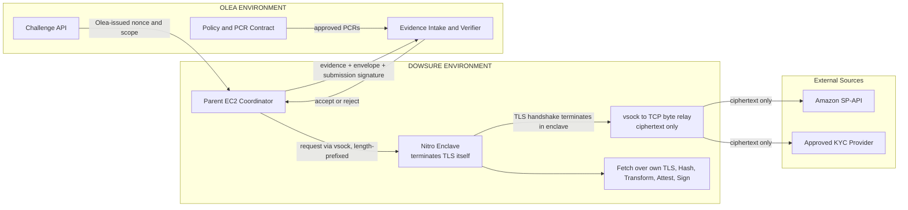
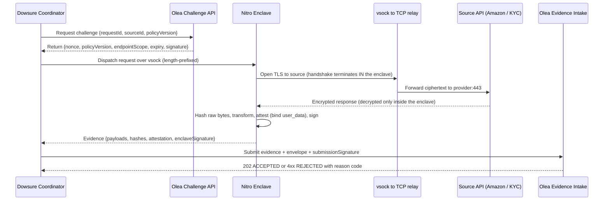

# Olea-Dowsure Verifiable Data Oracle

> **Plain-English summary.** This is the Dowsure-facing handoff. It defines the
> boundary between the two companies and the exact message shapes they exchange.
> In short: Olea hands out a one-time "challenge" (a scoped permission slip with a
> single-use number). Dowsure runs the fetch inside a sealed, tamper-proof virtual
> machine (an **AWS Nitro Enclave**), which **opens its own TLS connection to the
> source (TLS-in-TEE)**, hashes and transforms the data, and signs a receipt. Dowsure
> wraps that receipt in a signed envelope and submits it to Olea, which verifies
> everything and accepts or rejects it. The TLS-in-TEE path is **proven live —
> 7 source calls returning 202 ACCEPTED** (3 Amazon SP-API + 4 KYC vendors).
> For the authoritative status facts, see
> [docs/PROJECT_STATUS_MATRIX.md](docs/PROJECT_STATUS_MATRIX.md).
>
> Acronyms on first use: SP-API (Selling Partner API, Amazon's seller data API),
> Nitro Enclave (isolated tamper-proof virtual machine, no storage, no normal network),
> vsock (virtual socket, the only channel between the enclave and its host), KYC (Know
> Your Customer), S3 (Amazon Simple Storage Service), LWA (Login with Amazon),
> TLS-in-TEE (the enclave terminates TLS itself; no external notary on the live path),
> EIF (Enclave Image File, the artifact that boots inside the enclave), PCR
> (Platform Configuration Register, a hash that fingerprints the EIF), SBOM (Software
> Bill of Materials).
>
> **Consistency note.** This document must agree with the single internal handoff
> ([IMPLEMENTATION_AGENT_HANDOFF.md](IMPLEMENTATION_AGENT_HANDOFF.md)) and the status
> matrix: the running enclave uses CID 16; the oracle uses **TLS-in-TEE** — the
> enclave terminates TLS itself (no external MPC-TLS notary on the live path); and 7
> source calls are proven live with 202 ACCEPTED. The pre-conversion (notary) version
> of this handoff is kept at
> [archive/dowsure-implementation-handoff.pre-tls-in-tee.md](archive/dowsure-implementation-handoff.pre-tls-in-tee.md).

## 1. Architecture and Boundaries



### Boundary rules

- Dowsure calls Olea's Challenge API; Olea generates the nonce, scope, policy version, and expiry.
- Dowsure must use only the returned `sourceId` and policy scope.
- The parent/host runs only a `vsock→TCP` relay; it **must not** terminate, inspect,
  rewrite, cache, or substitute source TLS — the enclave terminates TLS itself and the
  relay carries only ciphertext.
- The enclave has no vNIC or persistent storage and is the only approved
  source-processing boundary; the server certificate and hostname are verified **inside**
  the enclave against a CA bundle baked into the EIF.
- Dowsure must not maintain a side path for policy-covered source calls.

## 2. Defined Interfaces

### 2.1 Challenge request: Dowsure -> Olea

```json
{
  "requestId": "req-123",
  "sourceId": "getOrderMetrics",
  "policyVersion": "v1.0"
}
```

`sourceId` is one of the 7 registered calls: `getOrderMetrics`,
`listFinancialEventGroups`, `listTransactions`, `alicloudTelThree`,
`qichachaEnterpriseVerify`, `qichachaShixinCheck`, `gutuPanoramaChecks`.

### 2.2 Challenge response: Olea -> Dowsure

```json
{
  "requestId": "req-123",
  "nonce": "single-use-random-value",
  "policyVersion": "v1.0",
  "sourceId": "getOrderMetrics",
  "endpointScope": ["getOrderMetrics"],
  "issuedAt": "2026-09-22T12:00:00Z",
  "expiresAt": "2026-09-22T12:05:00Z",
  "challengeSignature": "olea-kms-signature"
}
```

Dowsure must reject a missing, expired, mismatched, or out-of-scope challenge.

### 2.3 Evidence submission: Dowsure -> Olea

The enclave produces the evidence fields; the coordinator adds the envelope + Dowsure
signature and submits the flattened object to `POST /v1/evidence`:

```json
{
  "requestId": "req-123",
  "evidenceId": "ev-456",
  "nonce": "single-use-random-value",
  "sourceId": "getOrderMetrics",
  "policyVersion": "v1.0",

  "rawPayload": { "...": "source data" },
  "rawResponseB64": "base64-of-wire-bytes",
  "rawPayloadDigest": "sha256-of-wire-bytes",
  "transformedPayload": { "...": "pass-through today" },
  "transformedPayloadDigest": "sha256-of-canonical-output",
  "canonicalizationVersion": "RFC8785-PoC",
  "manifestDigest": "sha256-of-canonical-manifest",

  "attestationDocument": "base64url-cbor-attestation",
  "attestedPublicKeyBase64": "enclave-ephemeral-public-key",
  "enclaveSignature": "enclave-signature-over-manifest",

  "eifDigest": "sha256-of-approved-eif",
  "pcr0": "...", "pcr1": "...", "pcr2": "...",

  "submissionEnvelope": { "...": "canonical envelope json" },
  "submissionSignature": "dowsure-signature-over-envelope"
}
```

There are **no** `tlsProof*` fields and no `source`/`operation`/`endpoint` triple — the
enclave's own TLS termination under attestation is the origin anchor, and `sourceId`
selects the call. The submission signature covers the envelope (manifest digest,
request ID, nonce, policy version, evidence ID, submission timestamp).

## 3. Runtime Flows



## 4. Dowsure Responsibilities

| Area | Dowsure must deliver |
| --- | --- |
| Infrastructure | Nitro-capable EC2, enclave support, `vsock-proxy` egress relay, security groups, runtime roles |
| Source access | Seller consent, LWA client/scopes, approved endpoints, provider credentials for the enclave |
| EIF | Pinned commit, PR approval, tests, SBOM, signed manifest, EIF digest, PCR measurements |
| Runtime | Parent coordinator, vsock dispatch, `vsock→TCP` relay, enclave launch, rollback |
| Enclave | Fetch over its own TLS, raw hash, approved transform, attestation, signing |
| Evidence | Payloads, hashes, attestation, PCRs, enclave signature, Dowsure submission signature |

### Olea-facing dependencies

Dowsure depends on Olea for:

- Challenge API and policy response.
- Approved `sourceId` registry, disclosure, transformation, and canonicalization rules.
- Approved EIF/PCR registration (and, once production secret delivery lands, the KMS
  attestation-gated key policy).
- Evidence submission schema and response reason codes.

(No external TLSNotary service is required — the enclave terminates TLS itself.)

## 5. Java Reference Code

Illustrative Java-style pseudocode only. The interfaces below must be implemented and versioned before integration.

```java
EvidenceSubmission acquireAndSubmit(AcquisitionRequest request) {
    Challenge challenge = olea.requestChallenge(
        request.requestId(), request.sourceId(), request.policyVersion());

    require(challenge.requestId().equals(request.requestId()), "CHALLENGE_MISMATCH");
    require(challenge.expiresAt().isAfter(Instant.now()), "EXPIRED_CHALLENGE");

    // The enclave fetches over its own TLS, hashes, transforms, attests, and signs.
    EvidenceResult result = enclave.acquire(request, challenge);

    String envelope = canonicalizer.canonicalize(Map.of(
        "requestId", challenge.requestId(),
        "nonce", challenge.nonce(),
        "policyVersion", challenge.policyVersion(),
        "evidenceId", result.evidenceId(),
        "manifestDigest", result.manifestDigest(),
        "encryptedEvidenceReference", result.encryptedEvidenceReference(),
        "submittedAt", Instant.now().toString()));

    return olea.submitEvidence(result.withEnvelope(
        envelope, dowsureSigner.sign(envelope)));
}
```

### 5.1 Enclave acquisition and evidence creation

```java
EvidenceResult acquire(AcquisitionRequest request, Challenge challenge) {
    SourceDefinition def = sourceRegistry.resolve(request.sourceId());  // 7 registered calls
    require(def != null, "SOURCE_SCOPE_INVALID");

    EphemeralKeyPair keyPair = nsm.generateEphemeralP256KeyPair();

    // Enclave opens its OWN TLS connection to the source over the vsock->TCP relay.
    byte[] rawBytes = sourceTlsClient.fetch(def, credentialProvider.headersFor(def));
    String rawHash = sha256(rawBytes);
    Object output = transformer.apply(rawBytes, policy);        // pass-through today
    String outputHash = sha256(canonicalizer.canonicalize(output));

    AttestationDocument attestation = nsm.attest(
        keyPair.publicKey(),
        canonicalizer.canonicalize(Map.of(
            "requestId", challenge.requestId(),
            "nonce", challenge.nonce(),
            "policyVersion", challenge.policyVersion(),
            "sourceId", request.sourceId(),
            "rawHash", rawHash,
            "transformedHash", outputHash,
            "publicKey", keyPair.publicKey())));

    String manifest = canonicalizer.canonicalize(Map.of(
        "requestId", challenge.requestId(),
        "evidenceId", request.evidenceId(),
        "sourceId", request.sourceId(),
        "nonce", challenge.nonce(),
        "policyVersion", challenge.policyVersion(),
        "rawSourceHash", rawHash,
        "transformedHash", outputHash,
        "canonicalizationVersion", "RFC8785-PoC",
        "attestedPublicKeyBase64", keyPair.publicKey()));

    byte[] enclaveSignature = enclaveSigner.sign(keyPair.privateKey(), manifest);
    keyPair.destroyPrivateKey();
    return new EvidenceResult(rawBytes, output, rawHash, outputHash,
                              manifest, attestation, enclaveSignature);
}
```

Required interfaces:

- `OleaClient.requestChallenge(...)`
- `OleaClient.submitEvidence(...)`
- `EnclaveClient.acquire(...)`
- `SourceRegistry.resolve(...)`           // the 7 registered sources
- `SourceTlsClient.fetch(...)`            // enclave-terminated TLS
- `CredentialProvider.headersFor(...)`    // PoC: baked key; prod: KMS-attested secret
- `TransformationEngine.apply(...)`       // pass-through today
- `SubmissionSigner.sign(...)`
- `Canonicalizer.canonicalize(...)`

## 6. EIF Governance

- Every EIF change requires a named code owner and pull-request approval.
- CI must run tests, dependency scans, SBOM generation, reproducible build, EIF creation, and PCR measurement.
- Dowsure submits the signed release manifest and EIF digest to Olea.
- Dowsure deploys only after Olea registers the exact digest/PCR set as active.
- A revoked release is terminal for new evidence.
- An EIF rebuild changes the PCRs; the release registration (and, once it lands, the KMS
  attestation policy) must be updated together.

## 7. Acceptance Criteria

Dowsure is PoC-ready when:

- The selected `sourceId`s work through the approved source path (enclave-terminated TLS).
- Dowsure calls Olea for every policy-covered challenge.
- No out-of-enclave or unapproved source side path exists.
- Tokens and sensitive payloads are absent from logs, disk, and the EIF.
- Raw and transformed hashes are reproducible and match the attested binding.
- Nitro attestation and PCRs match Olea's registered release.
- Submission-envelope signatures validate.
- Invalid, stale, replayed, tampered, and revoked-release evidence is rejected.
- Monitoring, rollback, and support ownership are demonstrated.

## 8. References

- <https://docs.aws.amazon.com/enclaves/latest/user/nitro-enclave-concepts.html>
- <https://docs.aws.amazon.com/enclaves/latest/user/nitro-enclave.html>
- <https://docs.aws.amazon.com/enclaves/latest/user/set-up-attestation.html>
- Historical (pre-conversion, MPC-TLS/notary): `archive/dowsure-implementation-handoff.pre-tls-in-tee.md`, `archive/TLSNOTARY.md`
